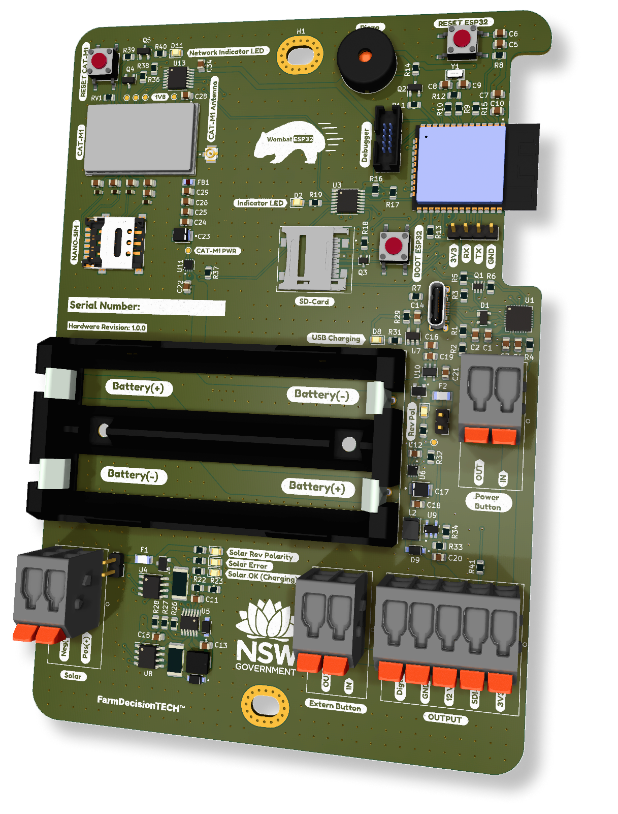

<h2 align="center">
    Enviro-Node
</h2>

  <a href="#about">About</a> •
  <a href="#Installation">Install</a> •
  <a href="#Firmware">Firmware</a> •
  <a href="#license">License</a>

    

## About

Enviro-node is a environmental monitoring node. Users can connect a number of sensors to a node. Data captured from these sensors is then sent to a database over [MQTT](https://mqtt.org/).

There are three parts to the enviro-node:

1. The physical hardware (electronics).

2. The firmware operating on the device.

3. A [mobile application](https://github.com/DPIclimate/blue-tongue) (known as blue-tongue) for setting up the device in the field.

The first two parts are housed in this repository. The [blue-tongue](https://github.com/DPIclimate/blue-tongue) mobile application is housed in its own repository.

## Hardware

The hardware was developed using [KiCad](https://www.kicad.org/). Source files can be found [here](https://github.com/DPIclimate/enviro-node/tree/master/electronics/motherboard/motherboard-mini). While sleeping the Enviro-node will consume ~70 µA.

### Microcontroller ([schematic](https://github.com/DPIclimate/enviro-node/blob/master/imgs/schematics/microcontroller.pdf))

The device incorporates a ESP32 microcontroller to handle bluetooth functions and peripherals. The ESP32 has a very low sleep current of ~16 µA making it perfect for low-powered applications.

### Debug and USB Interfaces ([schematic](https://github.com/DPIclimate/enviro-node/blob/master/imgs/schematics/microcontroller.pdf))

Enviro-node features full debug capability when connected to an [ESP-Prog](https://espressif-docs.readthedocs-hosted.com/projects/espressif-esp-iot-solution/en/latest/hw-reference/ESP-Prog_guide.html) (ESP32 debugger/programmer). It is recommended that you use a USB-to-TTL cable during development. This allows you to have the ESP-Prog connected to the Enviro-node while monitoring the ESP32's serial output via the USB-to-TTL connector. 

A USB-C interface is also incorporated to allow new firmware to be flashed to the microcontroller.

### Power Distribution ([schematic](https://github.com/DPIclimate/enviro-node/blob/master/imgs/schematics/power_distribution.pdf))

#### Battery

The Enviro-node is powered by two 18650 LiPo cells connected in parallel (4.2 V). A current jumper is available to monitor current and voltage on an external device such as a multi-meter. The batteries feature reverse polarity detection and protection and an inline fuse. 

An INA219 IC is connected to the battery to allow for real-time monitoring of battery current and voltage.

#### Solar

The batteries are recharged through a LT3652IMSE solar charging IC or via a USB-C battery charging IC (MCP73832). The default configuration allows for 12 V solar panels to be connected to the device; however, this can be set via a resistor divider.

The solar input features reverse polarity detection and protection as well as an inline fuse and charging/error indicators.

The charging current of the solar panel is limited to a maximum of 1 A and is monitored through another INA219 IC.

#### 3.3 V Interface

Most components on Enviro-node operate using 3.3 V for this a linear regulator is incorporated (XC6215B332MR-G). A power supply switch is connected to the output of this regulator to allow the ESP32 (and peripherals) to be manually turned off or restarted.

#### 12 V Interface for SDI-12 Devices

Although many SDI-12 devices will work with 3.3 V, the Enviro-node incorporates a 12 V step-up regulator (MIC2288YD5) to provide a stable 12 V (100 mA) supply. This IC's can be toggled in the firmware via a GPIO pin and will be completely shutoff when not in use.

If a SDI-12 sensor requires a constant 12 V supply the current consumption of this step-up regulator is ~2 mA with no load.

### Peripherals ([schematic](https://github.com/DPIclimate/enviro-node/blob/master/imgs/schematics/peripherals.pdf))

#### IO Expander

As a full debug interface is supplied and there are several operating interfaces (I2C, SPI, UART) the number of available GPIO pins on the ESP32
is limited. Therefore, an IO-expanded is provided (TCA9534) to control many IC's power consumption including CAT-M1, the SD-Card and 12 V power.

A LED is also connected the IO-expander that the user can configure.

#### Piezo Buzzer

For audible feedback a piezo buzzer is included and will play *success* and *error* tones while the device is being configured and on startup. Under normal conditions the piezo buzzer will be quiet.

#### Programmable Button

An external programmable button is connected to a GPIO input pin on the ESP32. On startup if this button is held down the device will enter a programmable state whereby BluetoothLE will be enabled and a UART CLI interface will become available. Once the user types "exit\r" the CLI will be exited and normal operations will continue.

#### SD-Card

Environmental monitoring requires a SD-Card to ensure data is captured even when communications are down. The Enviro-node provides a top entry, Micro-SD card slot that can be disconnected from its power supply via a GPIO pin (see IO-Expander above).

#### SDI-12

A full SDI-12 interface is provided. No level-shifting is incorporated as the ESP32 can handle 5 V. Users can either use the 12 V output and toggle the output on-and-off or use the 3.3 V output for always on devices.

#### Digital (pulse counter)

A digital pin is provided to the user to count pulses originating from a Tipping Bucket or wind-speed sensor.

### CAT-M1 ([schematic](https://github.com/DPIclimate/enviro-node/blob/master/imgs/schematics/cat_m1.pdf))

The Enviro-node uses CAT-M1 to send messages (containing JSON encoded data) over MQTT. For this a SARA-R5 modem is incorporated into the design. This modem communicates with the ESP32 microcontroller over AT-commands via a Serial (UART) interface. 

> **Note** A compatible nano-sim card is required for this functionality of the device. For Australian users [Telstra](https://telstra.m2m.com/) has a M2M service or there are other global services such as [Hologram](https://www.hologram.io/products/global-iot-sim-card/).

The modem is directly powered by the 18650 batteries (as the modem can draw ~500 mA) and can be turned off and on via a GPIO pin (see IO-Expander above). A network indicator LED will indicate network connection status.

## License

This project is MIT licensed, as found in the LICENCE file.
